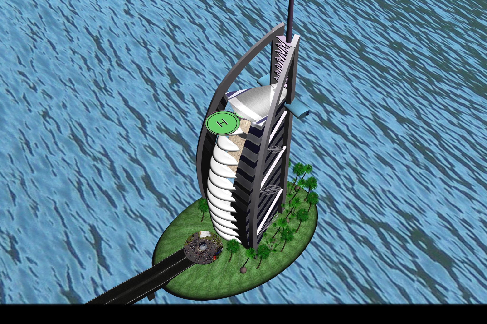
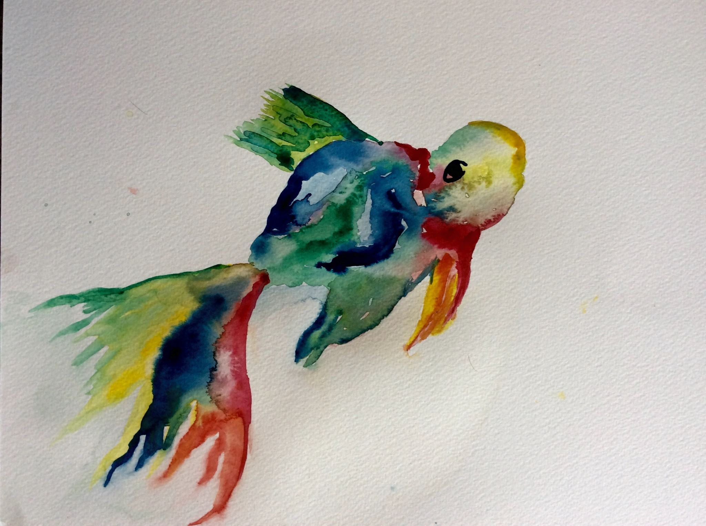
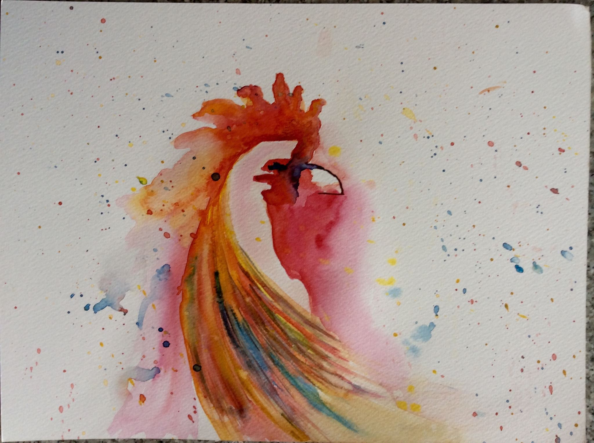
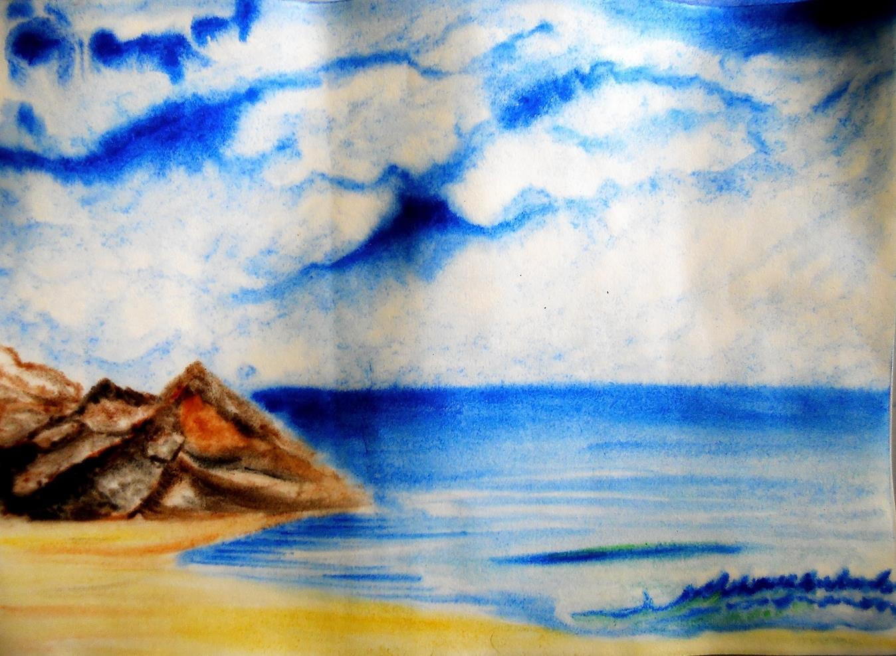
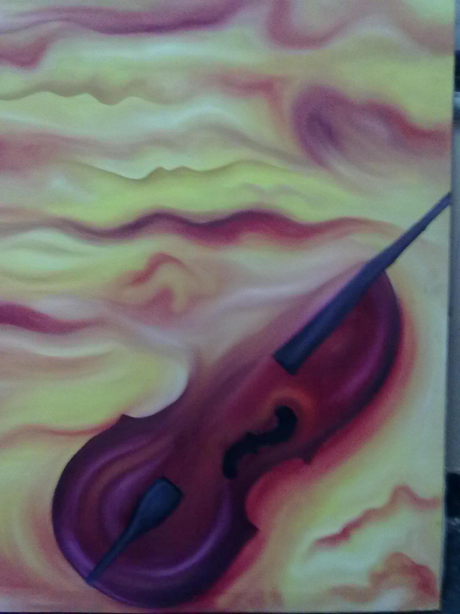

----

All the art images below are my own creation, though the idea may not be original. 
Every art has its own significance, and I have tried to highlight some of that in the caption. 
However, like every art, the interpretations of the art are supposed to be personal. 

## Burj Al Arab (3D Model)
 

  

 

<!-- --------------------------------------------------- -->
## Water Colors
 

  

 

<!-- --------------------------------------------------- -->
## Oil on canvas
 

 

<!-- --------------------------------------------------- -->

----

Feel free to explore the different sections on my art, science, and other hobbies.
<!-- Creat the social icons requires the css of the font awesome, do not delete the next line -->
<link rel="stylesheet" href="https://cdnjs.cloudflare.com/ajax/libs/font-awesome/4.7.0/css/font-awesome.min.css">

<a href="http://www.facebook.com/hornpit"> <i class="fa fa-facebook"></i> </a>&nbsp;&nbsp;&nbsp;
<a href="http://github.com/harmanjit"> <i class="fa fa-github"></i> </a>&nbsp;&nbsp;&nbsp;
<a href="skype:harman767@gmail.com"> <i class="fa fa-skype"></i> </a>&nbsp;&nbsp;&nbsp;
<a href="http://www.medium.com/@harmanjitBansal"> <i class="fa fa-medium"></i> </a>&nbsp;&nbsp;&nbsp;
<a href="http://www.twitter.com/@harmanjitBansal"> <i class="fa fa-twitter"></i> </a>&nbsp;&nbsp;&nbsp;
<a href="http://www.linkedin.com/in/harman1"> <i class="fa fa-linkedin"></i> </a>&nbsp;&nbsp;&nbsp;
<a href="http://www.pinterest.com/harmanjitsb"> <i class="fa fa-pinterest"></i> </a>&nbsp;&nbsp;&nbsp;
